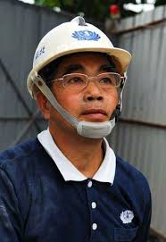
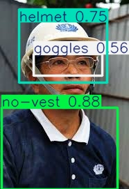

# YOLOv8 PPE 檢測專案

基於 [Ultralytics YOLOv8](https://github.com/ultralytics/ultralytics) 的個人防護裝備（Personal Protective Equipment, PPE）物件檢測專案。使用 YOLOv8n 模型，支援訓練、推論、測試集評估與多格式模型匯出。

**Repository：** https://github.com/anson1eechun/yolov8_ppe_project

---

## 功能概述

| 腳本 | 功能 |
|------|------|
| `train.py` | 從預訓練權重或 checkpoint 訓練 / 續訓模型 |
| `predict.py` | 對圖片、影片、資料夾進行推論 |
| `predict_video.py` | 影片推論，支援 `--conf`、`--save-dir` 參數 |
| `test_model.py` | 在測試集上計算 mAP、Precision、Recall |
| `export_model.py` | 將模型匯出為 ONNX、TensorRT 等部署格式 |

---

## 專案結構

```
yolov8_ppe_project/
├── train.py
├── predict.py
├── predict_video.py
├── test_model.py
├── export_model.py
├── requirements.txt
├── data.yaml                          # 類別定義（參考用，與資料集內相同）
├── models/
│   ├── yolov8n.pt                     # COCO 預訓練權重（訓練起點）
│   └── best.pt                        # 已訓練完畢的最佳模型（推論用）
├── PPE detection.v1i.yolov8/          # YOLO 格式資料集
│   ├── data.yaml
│   ├── train/images, train/labels
│   ├── valid/images, valid/labels
│   └── test/images,  test/labels
└── runs/
    ├── detect/ppe_yolov8n/            # 訓練輸出（weights、曲線圖等）
    └── detect/predict/                # 推論輸出
```

---

## 環境需求

- Python 3.8+
- Windows / Linux / macOS
- 建議：NVIDIA GPU + CUDA（訓練與大量推論）

### 安裝依賴

```bash
git clone https://github.com/anson1eechun/yolov8_ppe_project.git
cd yolov8_ppe_project
py -m pip install -r requirements.txt
```

### GPU 環境（選用）

有 NVIDIA GPU 時，建議另行安裝 CUDA 版 PyTorch：

```bash
py -m pip install torch torchvision torchaudio --index-url https://download.pytorch.org/whl/cu121
```

`train.py` 會自動偵測 CUDA：有 GPU 時使用 `device=0`、`batch=16`；否則退回 CPU（`batch=4`）。

---

## 資料集

資料來源：[Roboflow PPE Detection v1](https://universe.roboflow.com/testcasque/ppe-detection-qlq3d/dataset/1)（CC BY 4.0）

| Split | 數量 |
|-------|------|
| train | 3,597 |
| valid | 1,026 |
| test  | 518 |

### 類別（nc: 10）

```
boots, gloves, goggles, helmet, no-boots, no-gloves, no-goggles, no-helmet, no-vest, vest
```

採正負類別成對設計：`helmet` / `no-helmet`、`vest` / `no-vest` 等，可直接用於合規違規偵測。

標註格式為 YOLO 標準格式（`class_id x_center y_center width height`，座標正規化至 0–1）。

配置檔路徑：`PPE detection.v1i.yolov8/data.yaml`

---

## 使用方式

所有指令均需在專案根目錄執行。

### 推論

載入 `models/best.pt` 進行推論，預設信心度閾值 `conf=0.25`，輸入尺寸 640。

**單張圖片：**

```bash
py predict.py test_01.png
py predict.py "C:\path\to\image.jpg"
```

**影片：**

```bash
py predict.py video.mp4
```

支援副檔名：`.mp4`, `.avi`, `.mov`, `.mkv`, `.flv`, `.wmv`, `.webm`

**資料夾（批次）：**

```bash
py predict.py path/to/images/
```

**輸出位置：** `runs/detect/predict/`

推論同時寫入 YOLO 格式標註 txt（`save_txt=True`, `save_conf=True`）。

#### 推論效果對照

以下以專案內建的 `test_01.png` 為例，展示 `predict.py` 的輸入與輸出：

```bash
py predict.py test_01.png
```

| 原始輸入 | 推論輸出 |
|:--------:|:--------:|
|  |  |
| `test_01.png` | `runs/detect/predict/test_01.jpg` |

**本例偵測結果（conf ≥ 0.25）：**

| 類別 | 信心度 | 判定 |
|------|--------|------|
| `helmet` | 0.75 | 已配戴安全帽 |
| `goggles` | 0.56 | 偵測到護目鏡（此例為一般眼鏡，模型可能與護目鏡類別混淆） |
| `no-vest` | 0.88 | 未穿反光背心 |

框線顏色由 Ultralytics 依類別自動分配；標籤格式為 `類別 信心度`。標註座標另存於 `runs/detect/predict/labels/test_01.txt`。

#### predict_video.py

提供額外 CLI 參數：

```bash
py predict_video.py video.mp4
py predict_video.py video.mp4 --conf 0.5
py predict_video.py video.mp4 --conf 0.3 --save-dir output/
```

| 參數 | 說明 | 預設 |
|------|------|------|
| `--conf` | 信心度閾值（0.0–1.0） | 0.25 |
| `--save-dir` | 輸出目錄 | `runs/detect/predict` |

---

### 訓練

```bash
py train.py
```

| 參數 | 值 |
|------|-----|
| 預訓練權重 | `models/yolov8n.pt` |
| epochs | 100 |
| imgsz | 640 |
| patience | 50 |
| save_period | 每 10 epoch 存檔 |
| 輸出目錄 | `runs/detect/ppe_yolov8n/` |

若存在 `runs/detect/ppe_yolov8n/weights/last.pt`，會自動從 checkpoint 續訓（`resume=True`）。

訓練完成後，最佳權重位於：

```
runs/detect/ppe_yolov8n/weights/best.pt
```

> **注意：** 推論腳本（`predict.py`、`predict_video.py`、`test_model.py`、`export_model.py`）讀取的是 `models/best.pt`，而非 `runs/` 下的輸出。重新訓練後需手動複製：
>
> ```bash
> copy runs\detect\ppe_yolov8n\weights\best.pt models\best.pt
> ```

---

### 測試集評估

```bash
py test_model.py
```

在測試集（`split="test"`）上輸出：

- mAP50
- mAP50-95
- Precision
- Recall
- 各類別 mAP50

---

### 模型匯出

```bash
py export_model.py
```

互動式選單，可匯出以下格式（`imgsz=640`）：

| 選項 | 格式 | 用途 |
|------|------|------|
| 1 | ONNX | 跨平台推理（ONNX Runtime 等） |
| 2 | TensorRT (`.engine`) | NVIDIA GPU 加速 |
| 3 | CoreML | Apple 生態系 |
| 4 | TensorFlow SavedModel | TF 部署 |
| 5 | TensorFlow Lite | 行動 / 嵌入式 |
| 6 | OpenVINO | Intel 硬體加速 |
| 7 | 全部 | 依序嘗試上述格式 |

---

## 模型檔案說明

| 檔案 | 說明 |
|------|------|
| `models/yolov8n.pt` | YOLOv8 Nano，COCO 預訓練，作為 fine-tune 起點 |
| `models/best.pt` | 在 PPE 資料集上訓練後的最佳權重，供推論與匯出 |

---

## 依賴套件

```
ultralytics>=8.0.0
torch>=2.0.0
torchvision>=0.15.0
opencv-python>=4.8.0
pillow>=9.5.0
numpy>=1.24.0
pyyaml>=6.0
matplotlib>=3.7.0
pandas>=2.0.0
seaborn>=0.12.0
```

---

## 常見問題

**找不到 `models/best.pt`**

確認 `models/best.pt` 存在，或先執行 `train.py` 訓練後複製權重至 `models/`。

**找不到 `PPE detection.v1i.yolov8/data.yaml`**

資料集資料夾需位於專案根目錄。Clone 本 repository 已包含完整資料集。

**推論結果與預期不符**

可調整 `--conf` 閾值；光線、遮擋、距離等因素會影響檢測精度。

**訓練中斷**

再次執行 `py train.py` 即可從 `last.pt` 續訓。

---

## 授權

- 資料集：[CC BY 4.0](https://creativecommons.org/licenses/by/4.0/)（Roboflow PPE Detection）
